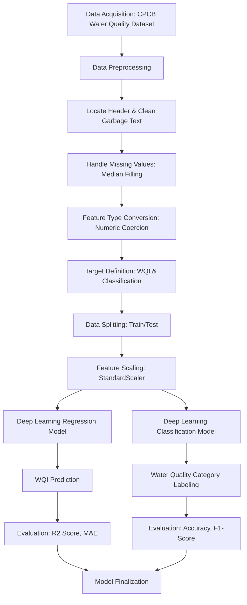

# Water Quality Prediction using Deep Learning Neural Networks (CPCB)

[](https://github.com/SANJAI-s0/WQI-WQP_using_DL_Neural_Network/blob/main/LICENSE)
[](https://github.com/SANJAI-s0/WQI-WQP_using_DL_Neural_Network/stargazers)
[](https://github.com/SANJAI-s0/WQI-WQP_using_DL_Neural_Network/issues)
[](https://www.python.org/)
[](https://www.tensorflow.org/)

This project utilizes Deep Learning Neural Networks to predict the **Water Quality Index (WQI)** and **Water Quality Classification** using environmental monitoring data provided by the Central Pollution Control Board (CPCB), India.

---

## 📋 Table of Contents
- [Project Overview](#-project-overview)
- [Dataset Description](#-dataset-description)
- [Workflow](#-workflow)
- [Installation and Setup](#-installation-and-setup)
- [Predictive Models](#-predictive-models)
- [Evaluation Metrics](#-evaluation-metrics)
- [Results](#-results)
- [License](#-license)
- [Contact](#-contact)

---

## 🔍 Project Overview
Access to clean water is a fundamental human necessity. However, water quality varies widely due to environmental, geographical, and human-induced factors. This project aims to accurately predict water quality metrics from chemical and physical parameters across various locations in India (2019-2022).

By leveraging Deep Learning, we provide two distinct predictive functionalities:
1. **Regression Analysis**: Predicting the numerical Water Quality Index (WQI).
2. **Multi-class Classification**: Categorizing samples into qualitative labels (e.g., Excellent, Good, Poor, Unsuitable).

---

## 📊 Dataset Description
The dataset contains chemical and physical samples collected from various wells across India.

### Features:
- **Geographical**: Well_ID, State, District, Block, Village, Latitude, Longitude.
- **Temporal**: Year (2019, 2020, 2021, 2022).
- **Indicators**: pH, Electrical Conductivity (EC), Carbonates (CO3), Bicarbonates (HCO3), Chlorides (Cl), Sulfates (SO4), Nitrates (NO3), Total Hardness (TH), Calcium (Ca), Magnesium (Mg), Sodium (Na), Potassium (K), Fluoride (F), Total Dissolved Solids (TDS).

### Targets:
- **WQI**: Continuous numerical value.
- **Water Quality Classification**: Categorical (Excellent, Good, Poor, Very Poor yet Drinkable, Unsuitable for Drinking).

---

## ⚙️ Workflow
The following diagram illustrates the data processing and modeling pipeline:



*(The workflow source is also available in [Flow/workflow.mmd](Flow/workflow.mmd))*

---

## 🚀 Installation and Setup
To run this project locally, ensure you have Python 3.10+ installed.

1. **Clone the repository:**
   ```bash
   git clone https://github.com/SANJAI-s0/WQI-WQP_using_DL_Neural_Network.git
   cd WQI-WQP_using_DL_Neural_Network
   ```

2. **Install dependencies:**
   ```bash
   pip install tensorflow pandas scikit-learn numpy matplotlib seaborn jupyter
   ```

3. **Run the analysis:**
   Open the Jupyter Notebook to view the full pipeline and metrics:
   ```bash
   jupyter notebook Water_Quality_Prediction.ipynb
   ```

---

## 🧠 Predictive Models
The project implements two separate Deep Neural Networks (DNN) using Keras/TensorFlow:

### 1. Regression Model (WQI)
- **Architecture**: Sequential API with multiple Dense layers (64 -> 32 -> 16 -> 1).
- **Optimizer**: Adam.
- **Loss Function**: Mean Squared Error (MSE).

### 2. Classification Model (Category)
- **Architecture**: Sequential API (64 -> 32 -> 16 -> output_classes).
- **Activation**: ReLU for hidden layers, Softmax for the output layer.
- **Loss Function**: Sparse Categorical Crossentropy.

---

## 📈 Evaluation Metrics
The models are evaluated based on the following:
- **Regression**: $R^2$ Score (Coefficient of Determination) and Mean Absolute Error (MAE).
- **Classification**: Accuracy Score and Weighted F1-Score.

---

## 🏆 Results
The models achieve reliable performance across the dataset. Detailed confusion matrices and loss curves can be found within the [Water_Quality_Prediction.ipynb](Water_Quality_Prediction.ipynb) notebook.

---

## 📄 License
This project is licensed under the MIT License - see the [LICENSE](LICENSE) file for details.

---

## 📧 Contact
**Sanjai** - [GitHub Profile](https://github.com/SANJAI-s0)

Project Link: [https://github.com/SANJAI-s0/WQI-WQP_using_DL_Neural_Network](https://github.com/SANJAI-s0/WQI-WQP_using_DL_Neural_Network)
